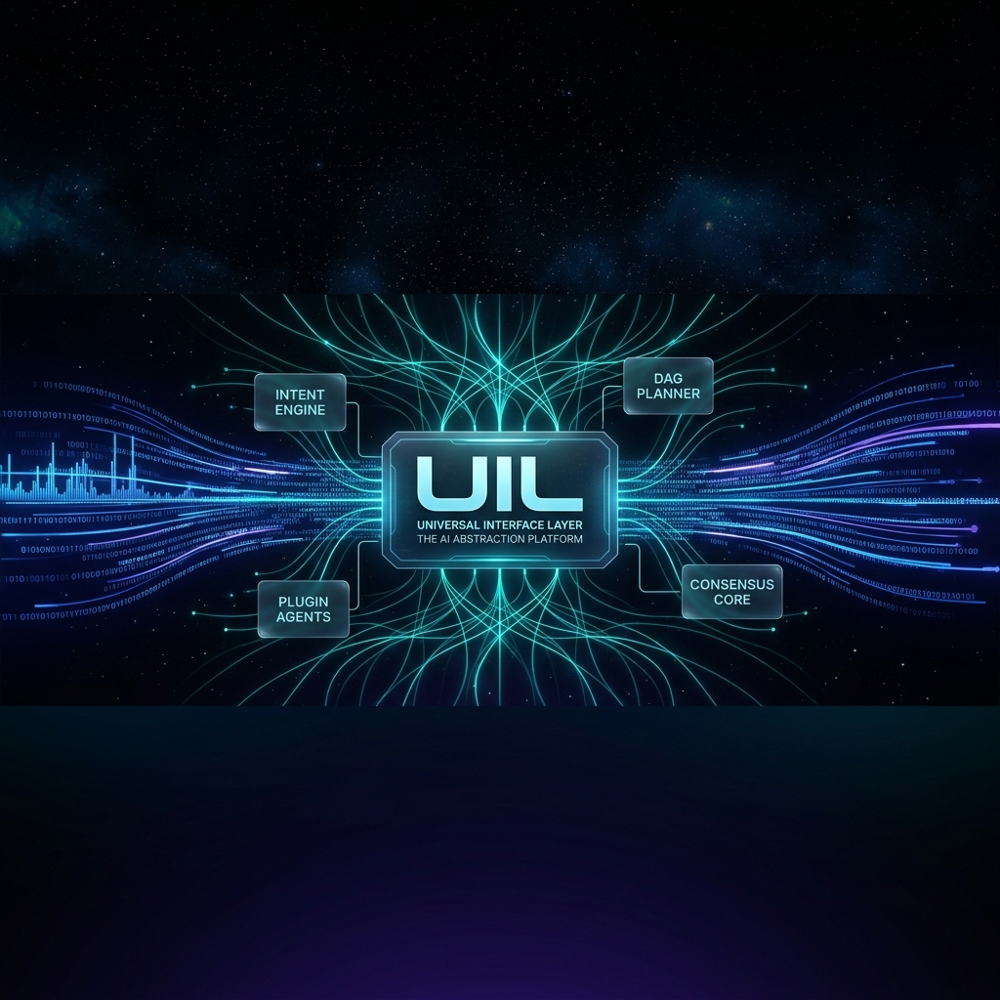
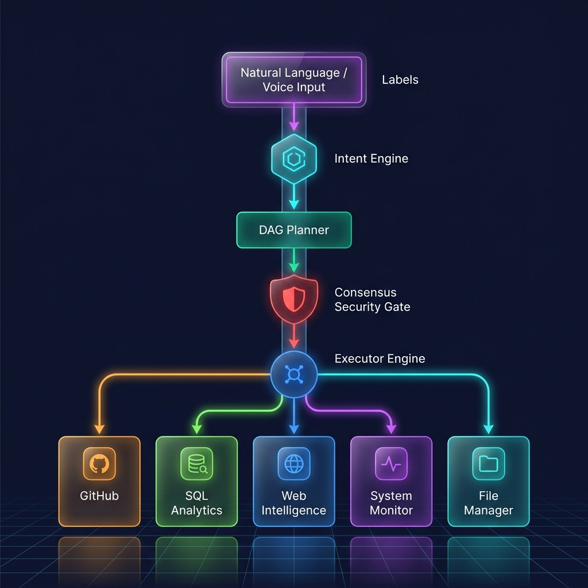
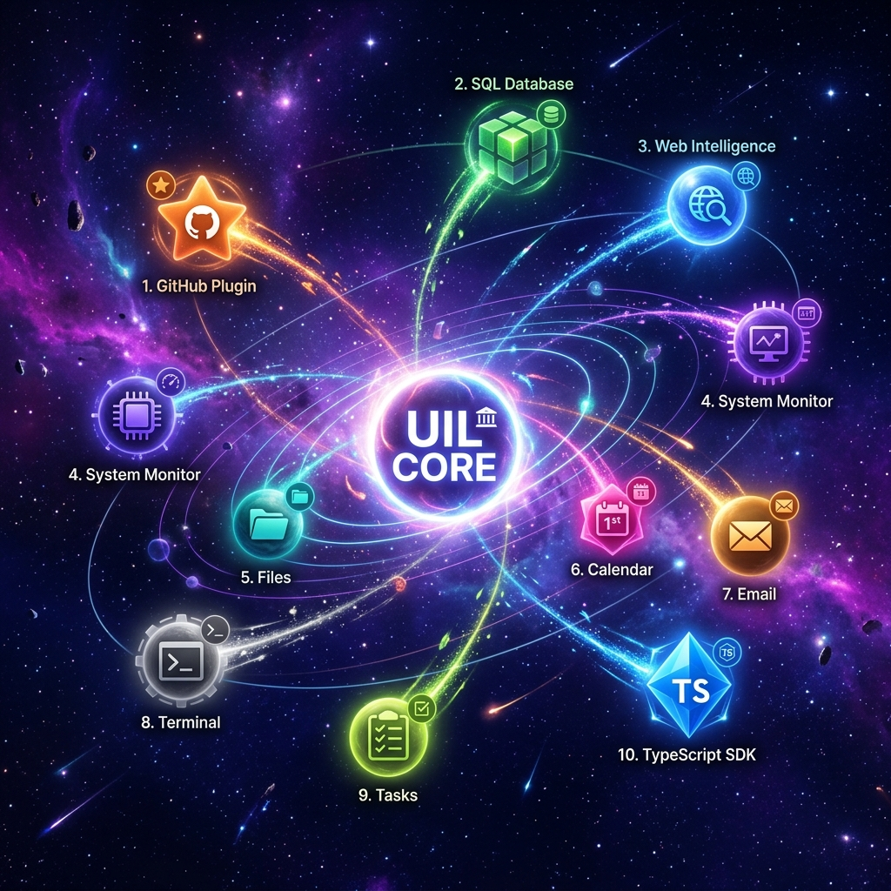
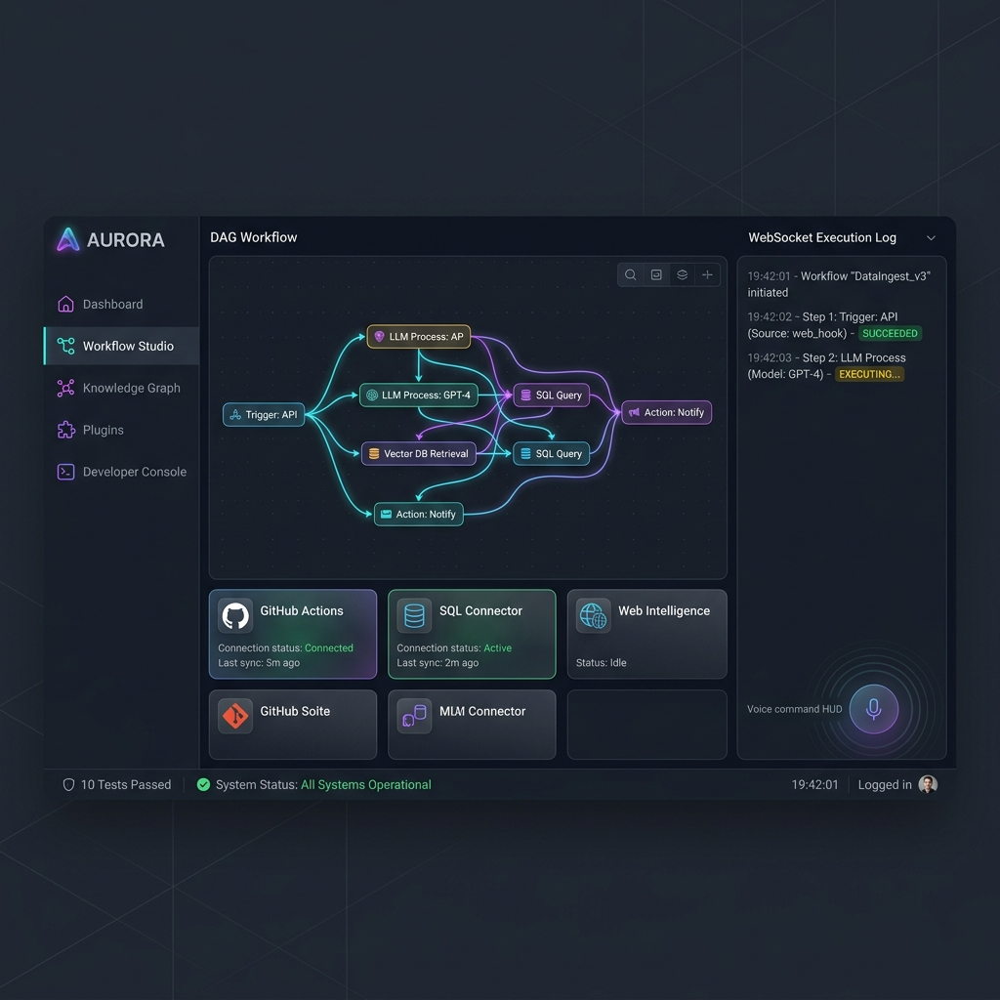
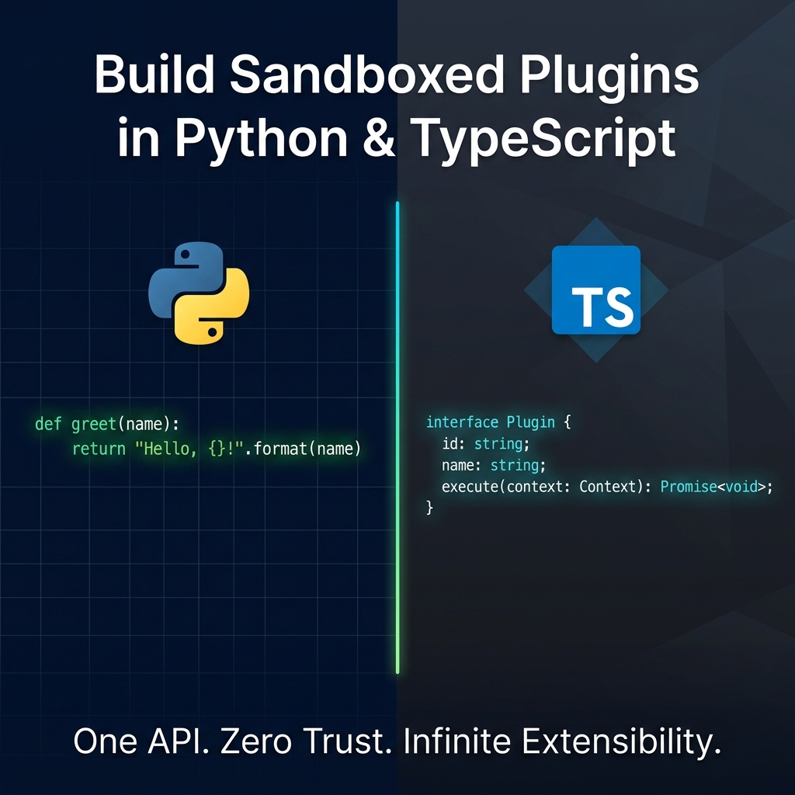

<div align="center">



# Universal Interface Layer (UIL) 🌌

**The AI-native Operating Interface for unifying developer & workplace workflows.**

[](LICENSE)
[](https://www.python.org/)
[](https://www.typescriptlang.org/)
[](https://fastapi.tiangolo.com/)
[](https://react.dev/)
[](.github/workflows/ci.yml)
[](https://vijaymahes9080.github.io/Universal-Interface-Layer/)

*Convert natural language & voice commands into sandboxed, topological execution graphs across local and cloud applications.*

🔗 **[▶ View Live Demo →](https://vijaymahes9080.github.io/Universal-Interface-Layer/)**


</div>

---

## 🏛 Architecture Overview

<div align="center">



</div>

UIL transforms natural language prompts into fully coordinated, dependency-aware DAG workflows. Every execution plan passes through the **Multi-Agent Consensus & Security Gate** before any action is taken.

```text
  User Prompt / Voice Input
          │
          ▼
    Intent Engine            ← Parses goals into structured plugin targets
          │
          ▼
  DAG Planner Engine         ← Topological DFS cycle detection + scheduling
          │
          ▼
  Consensus Security Gate    ← Multi-agent risk scoring & privilege escalation check
          │
          ▼
    Executor Engine          ← Parallel task runner with WebSocket telemetry
     ┌────┼────┐
     ▼    ▼    ▼
  Plugins ... (Zero-Trust Sandboxed Isolation)
```

---

## 🧩 Plugin Ecosystem

<div align="center">



</div>

UIL ships with **10+ production-grade, sandboxed plugins** out of the box:

| Plugin | Category | Core Commands |
|---|---|---|
| 🐱 **GitHub DevOps** | Developer Tools | `get_repo_info`, `list_issues`, `search_commits` |
| 📊 **SQL Analytics** | Data & Analytics | `query_database`, `describe_schema` |
| 🌐 **Web Intelligence** | Research | `fetch_url`, `extract_text` |
| 💻 **System Monitor** | Telemetry | `get_system_stats`, `list_processes` |
| 📁 **File Manager** | Workspace | `write_file`, `read_file` |
| 📅 **Calendar** | Productivity | `create_event`, `list_events` |
| ✉️ **Email** | Communication | `draft_email`, `send_email` |
| 🖥 **Terminal** | System | `run_command` (whitelist enforced) |
| ✅ **Tasks** | Productivity | `create_task`, `complete_task` |

---

## 🎨 Visual Dashboard & Workflow Studio

<div align="center">



</div>

UIL ships with a fully-featured **React 18 Dashboard** including:
- 🗺 **Visual Workflow Studio** — Drag-and-drop DAG node builder with live consensus validation
- 🎙 **Voice Command HUD** — Web Speech API integration for hands-free prompt submission
- 📡 **Real-time WebSocket Logs** — Live execution telemetry streamed from the backend
- 🌐 **Semantic Knowledge Graph** — Interactive SVG canvas of tasks, docs, and memory nodes
- 🔌 **Plugin Marketplace** — Enable, disable, and inspect every registered plugin

---

## 📁 Repository Structure

```text
Universal-Interface-Layer/
├── .github/
│   └── workflows/          # GitHub Actions CI/CD pipelines
├── apps/
│   ├── backend/            # FastAPI core server, engines (DAG, Consensus), plugins
│   └── frontend/           # React 18 client, Visual Workflow Studio, Voice HUD
├── sdk/
│   ├── python/             # Python UILPlugin SDK (uil_sdk)
│   └── typescript/         # TypeScript @uil/sdk (Node.js, fully typed)
├── docs/
│   ├── images/             # Project images and banners
│   ├── api.md              # API reference documentation
│   ├── plugin_guide.md     # Plugin authoring guide
│   └── sdd.md / srs.md     # Design & requirements specifications
├── scripts/
│   ├── setup.ps1           # Windows PowerShell installer
│   └── setup.sh            # macOS/Linux Bash installer
├── tests/                  # Pytest test suite (10 tests, 100% pass rate)
├── composer.json           # Project manifest with developer metadata
├── LICENSE                 # Apache 2.0 License
└── README.md
```

---

## ⚡ Quickstart

### Automated Setup

**Windows PowerShell:**
```powershell
powershell -ExecutionPolicy Bypass -File .\scripts\setup.ps1
```

**macOS/Linux Bash:**
```bash
chmod +x ./scripts/setup.sh && ./scripts/setup.sh
```

### Manual Execution

**1. Start the Backend:**
```bash
python -m apps.backend.main
# ► Running on http://127.0.0.1:8000
# ► Swagger UI: http://127.0.0.1:8000/docs
```

**2. Start the Frontend:**
```bash
cd apps/frontend && npm run dev
# ► React client: http://localhost:3000
```

---

## 🛠 SDK Integrations

<div align="center">



</div>

### Python SDK

```python
from uil_sdk import UILPlugin

plugin = UILPlugin(name="MyService", description="Custom integration plugin")

@plugin.command("push_update", description="Triggers sync tasks")
def push_update(url: str, content: str):
    return {"status": "success", "url": url}

if __name__ == "__main__":
    plugin.write_manifest_file("manifest.json")
```

### TypeScript SDK (`@uil/sdk`)

```typescript
import { UILPlugin } from '@uil/sdk';

const plugin = new UILPlugin('NodeService', 'Custom Node.js plugin');

plugin.registerCommand(
  'fetch_status',
  'Fetches service uptime',
  ['service_url'],
  ['status', 'uptime'],
  async (inputs) => ({ status: 'healthy', uptime: '99.9%' })
);

plugin.writeManifestFile('manifest.json');
```

---

## 🛡 Consensus Security Engine

Every DAG execution plan is evaluated by the **Multi-Agent Consensus Engine** before running:

```python
from apps.backend.engines.consensus import consensus_engine

plan = [
  {"id": "1", "plugin": "terminal", "action": "run_command", "inputs": {"command": "rm -rf /"}}
]

result = consensus_engine.evaluate_plan(plan)
# → { "safety_rating": "CRITICAL_RISK", "approved": False, "risk_score": 85 }
```

| Risk Score | Safety Rating | Action |
|---|---|---|
| `0 – 34` | ✅ SAFE | Executes immediately |
| `35 – 69` | ⚠️ MODERATE_RISK | Step-by-step human confirmation |
| `70 – 100` | 🚫 CRITICAL_RISK | Immediate halt |

---

## 🧪 Testing

```bash
python -m pytest tests/
```

```text
collected 10 items

tests/test_backend.py ....              [ 40%]
tests/test_plugins_extended.py ......  [100%]

======================= 10 passed, 6 warnings in 2.49s =======================
```

---

## 👤 Developer

<div align="center">

**Vijay Mahes**
📧 [Vijaypradhap2004@gmail.com](mailto:Vijaypradhap2004@gmail.com)
🐙 [@vijaymahes9080](https://github.com/vijaymahes9080)

</div>

---

## 📄 License

Licensed under the **Apache 2.0 License**. See [LICENSE](LICENSE) for details.

<div align="center">

*Built with ❤️ as a creative open-source AI platform.*

</div>
